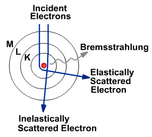
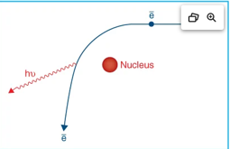
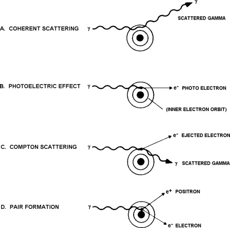
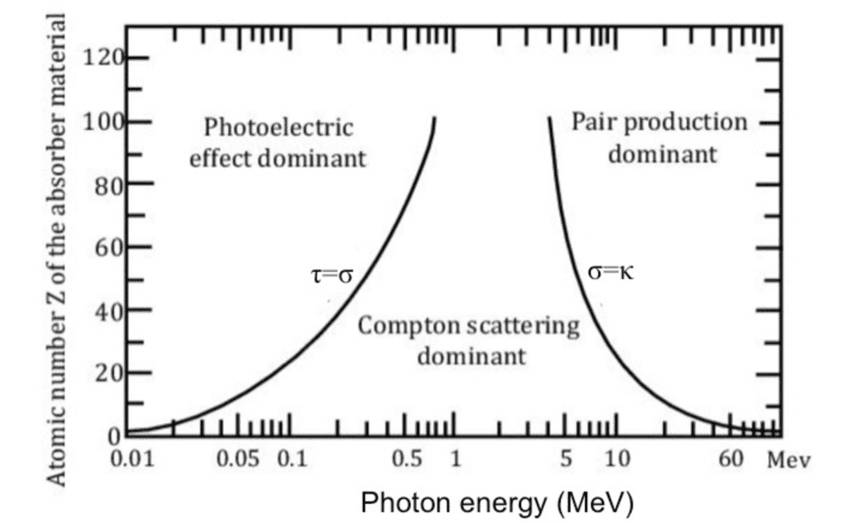

# Basic Interactions of Particles (Kahn Ch. 3)


> **Big idea:** Photon beams deposit dose indirectly. The photon transfers energy to charged particles, and those charged particles deposit energy in tissue (i.e. Dose).

---

## Topics: 
1. [Radiation for Dummies] (#radiation-for-dummies)
2. [Modes of X-Ray Production] (#modes-of-x-ray-production)
3. [Photon Interactions] (#photon-interactions)
4. [Charged Particle Interactions] (#charged-particle-interactions)


--- 
## 1. Radiation for Dummies

###  What is  Radiation?
- "Radiation" is the transmission of energy via waves or particles. 
- Radiation can be: 
	- Electromagnetic waves or particles with mass.
	- Charged or uncharged 
	- Ionizing or non-ionizing ()
- Planck-Einstein relationship describes the relationship between energy ($E$), frequency ($v$), and wavelength ($\lambda$): 

$$  
E = h\nu = \frac{hc}{\lambda}  
$$  

where: 

| Symbol    | Definition                                      |     |
| --------- | ----------------------------------------------- | --- |
| $E$       | Photon energy                                   |     |
| $h$       | Planck's constant ($6.626 \times 10^{-34}$ J·s) |     |
| $\nu$     | Frequency of the photon                         |     |
| $c$       | Speed of light ($3.00 \times 10^8$ m/s)         |     |
| $\lambda$ | Wavelength of the photon                        |     |

###  What is Ionizing Radiation?
- Radiation energy high enough to detach electron from atom $\rightarrow$ able to cause DNA damage.
- Threshold is 12 eV for ionization in water and 34 eV for creation of an ion pair in air. 


!!! Tip "Exam Tips"

- Water ionization energy to free an electron ≈ 12.6 eV  
- Mean energy per ion pair in air ≈ 34 eV
- For a 6 MV photon: $\lambda \approx 2.1 \times 10^{-13}\,\mathrm{m} \approx 0.2\,\mathrm{pm}$


## Fundamental Particle Types
  
| Particle       | Symbol   | Charge | Rest Mass       |     |
| -------------- | -------- | ------ | --------------- | --- |
| Photon         | $\gamma$ | 0      | 0               |     |
| Electron       | $e^-$    | -1     | 0.511 MeV/$c^2$ |     |
| Positron       | $e^+$    | +1     | 0.511 MeV/$c^2$ |     |
| Proton         | $p$      | +1     | 938.3 MeV/$c^2$ |     |
| Neutron        | $n$      | 0      | 939.6 MeV/$c^2$ |     |
| Alpha Particle | $\alpha$ | +2     | 3727 MeV/$c^2$  |     |
___

## 2. Modes of X-Ray Production
___
### **Bremsstrahlung Radiation: "Braking" Radiation**

- **Mechanism of Bremsstrahlung X-ray Production**: 
	- High energy $e^-$ $\rightarrow$  Redirected  $e^-$  + γ from $\Delta$ kinetic energy. 
	- Incident $e-$ is deflected by the nuclear Coulomb field $\rightarrow$ Change of electron direction gives up kinetic energy, which is emitted as an γ photon.


<div style="display:flex; gap:20px; justify-content:center;">  
  
  
</div>

- **Key Points**:
	- Continuous energy spectrum.
	- Dominant X-ray production modality in Linacs. 
		- Bremsstrahlung productions is proportional to: 
			- Electron energy ($E$)
			- Atomic number (Z)

$$  
Bremsstrahlung \propto ZE  
$$ 

!!! tip "Exam Tip"    Bremsstrahlung production increases with:    - Increasing atomic number (Z)    - Increasing electron energy (E)    Therefore tungsten (Z = 74) is an excellent linac target material.

___
### **Characteristic Radiation**
- **Mechanism of Characteristic X-ray Production**:
	- An incident electron ejects an inner-shell electron. $\rightarrow$ An outer-shell electron fills the vacancy. $\rightarrow$  The energy difference is emitted as an x-ray photon.

- **Characteristics**:
	- Discrete energies
	- Element-specific
	- Produces K-shell and L-shell x-rays
	- Common in Tungsten characteristic x-rays and fluoroscopy. 
	- Threshold energy cutoff: 
		$$E > E_{binding}$$​


### X-ray Production Modes Comparison

|Feature|Bremsstrahlung|Characteristic|
|---|---|---|
|Spectrum|Continuous|Discrete|
|Origin|Electron deceleration|Electron shell transitions|
|Depends on Z|Yes|Yes|
|Dominant in Linacs|Yes|Minor|
|Dominant in Diagnostic Tubes|Mostly|Partial contribution|

---

> **Big idea:**
	There are only two fundamental mechanisms of x-ray production:

	
	1. Bremsstrahlung Radiation
	2. Characteristic Radiation
	
	Clinical linacs produce nearly all therapeutic photons through Bremsstrahlung interactions in a tungsten target.

    


---

## 3. Photon Interactions

> **Big idea:** There are 4 main interactions between photons (X-rays and gamma rays) and matter. These are coherent scattering, photoelectric absorption, Compton scattering, and pair production. 
> 
> Several factors impact the probability that a photon will undergo an interaction with matter including the energy of the photon and the properties of the atoms making up the material, largely driven by the atomic number (Z) of the absorber.




#### Key dependencies: 
• Coherent Scattering: ~ Z/E²  
• Photoelectric Effect: ~ Z³/E³  
• Compton Scattering: ~ 1/E (independent of Z)  
• Pair Production: ~ Z ln(E)

____
###  Coherent (Rayleigh Scattering)


In **coherent scatter**, also called Rayleigh scatter, the photon interacts with the atom as a whole. The photon changes direction but does not lose significant energy.

### Key Features
- No ionization.
- No energy transfer to an electron.
- Photon changes direction.
- More relevant at low photon energies.
- Usually minor for radiation therapy dose deposition.

### Clinical Meaning:
- Coherent scatter is usually not a major player in MV therapy dose deposition, but it can contribute to low-energy imaging scatter.


____
###  Photoelectric Absorption

In **photoelectric absorption**, an incident photon transfers all of its energy to a tightly bound inner-shell electron. The photon is completely absorbed, and the electron is ejected from the atom.

### Key Features
- Complete absorption of the photon.
- Inner-shell electron is ejected.
- Produces ionization.
- Vacancy in the electron shell is created.
- Characteristic x-rays or Auger electrons may be emitted.
- Strong dependence on atomic number and photon energy.

$$  
\tau \propto \frac{Z^3}{E^3}  
$$
where:
- (Z) = atomic number
- (E) = photon energy

### Clinical Meaning

- Dominant interaction for low-energy photons.
- Responsible for much of the contrast in diagnostic imaging.
- More likely in high-Z materials such as bone, iodine, barium, and lead.
- Contributes to increased dose near metallic implants and shielding materials.
- Relatively uncommon in megavoltage external beam therapy where Compton scatter dominates.


_____
### Compton Scattering
In **Compton scatter**, an incident photon interacts with a loosely bound outer-shell electron. The photon transfers part of its energy to the electron and continues in a new direction with lower energy.

#### What Happens
- Incident  photon $\gamma$  interacts with an outer-shell  $e^{-1}$ 
- Outer $e^{-1}$  is ejected.
- The photon is scattered. 
- The scattered photon has reduced energy. 
- The recoil electron deposits dose locally.

![[ComptonScattering.jpg]]
#### Key Features:
- Photon is not completely absorbed.
- A scattered photon remains.
- A recoil electron is produced.
- Interaction depends mainly on electron density.
- Dominant for most MV photon therapy beams.

#### Clinical Meaning:
- **Compton scatter** is central to external beam therapy because it produces many of the secondary electrons responsible for **dose deposition in tissue**.

	It also contributes to:
	- patient scatter,
	- out-of-field dose,
	- room shielding considerations,
	- image degradation from scatter,
	- dose calculation dependence on electron density.

!!! tip "ABR favorite"  
In the MV range, interaction probability is approximately related to **electron density**, not strongly to atomic number.

___

### Pair Production 
In **pair production**, a photon interacts near the nuclear field and converts into an electron-positron pair. This requires a minimum photon energy of: 1.022 MeV, because the rest mass energy of two electrons is required.

### What Happens
1. High-energy photon passes near the nucleus.
2. Photon disappears.
3. Electron and positron are created.
4. The positron slows down in tissue.
5. Positron annihilates with an electron.
6. Two 511 keV photons are produced.


### Key Features
- Energy threshold is 1.022 MeV.
- Photon is converted into matter.  
- Produces an electron and positron.   
- Positron annihilation produces two 511 keV photons.   
- Becomes more important as photon energy increases.

### Clinical Meaning: 
- Pair production can occur in high-energy therapy beams, but Compton scatter is usually still the dominant interaction for common clinical MV photon beams.
- It is also conceptually connected to PET imaging because positron annihilation produces two 511 keV photons.

____
## Summary of Photon Interactions



| Interaction         | Photon Absorbed? |  Electron Produced? |                  Scattered Photon? | Therapy Relevance                     |
| ------------------- | ---------------: | ------------------: | ---------------------------------: | ------------------------------------- |
| Photoelectric       |              Yes |                 Yes |                                 No | Low-energy imaging and high-Z effects |
| Compton             |               No |                 Yes |                                Yes | Dominant in MV therapy                |
| Pair production     |              Yes | Electron + positron | 511 keV photons after annihilation | Higher-energy photon beams            |
| Coherent Scattering |               No |                  No |                                Yes | Minor for therapy dose                |


---

## 4. Charged Particle Interactions
#### Primary Particle Interactions:
• Ionization/Excitation with atomic electrons.
• Bremsstrahlung: Electron interaction with nucleus creates electron + photon/
• Elastic Scattering
	- **w/atomic electrons**: Electron-electron scattering 
	- **w/atomic nuclei**: Nuclear scattering 
• Inelastic Scattering
- **w/atomic electrons**: ionization or excitations 
- **w/atomic nuclei**: Bremsstrahlung

#### Secondary Atomic Relaxation Processes:
• Characteristic X-Ray Production  
• Auger Electron Production

#### Important Interactions per therapy type:
- Electrons:
	-  **Direct Ionization:** e- place enough energy in orbital e- to ionize (eject) them.
	-  **Bremsstrahlung:** e- is redirected around the nucleus creating a high energy γ and a redirected e-. More predominant for high electron energies.
		- Increases with Z and E.
	
- Photons: 
	- **Compton** is dominant for energies 50 keV to 10-20 MeV.
	- **Pair production** occurs at high energies, beginning at 1.02 MeV, becoming significant at ~10 MeV, and dominating at >20 MeV.
	- Photoelectric absorption is dominant < 50 keV, responsible for image contrast.
	
 - Protons: 
	- Inelastic scattering with atomic electrons $\rightarrow$ responsible for Bragg Peak
	- Elastic scattering with atomic nucleus $\rightarrow$ Multiple Coulomb Scattering causes lateral scatter.
	- Range Straggling $\rightarrow$  Ionization and excitation
	- Nuclear Interactions $\rightarrow$  Causes distal tail with due to secondary protons, neutrons, gamma rays, and nuclear fragments.

	


___
## 5. Section Summary

## Energy Dependence Summary


| Energy Region      | Most Important Interaction           | Practical Meaning                           |
| ------------------ | ------------------------------------ | ------------------------------------------- |
| Low energy / kV    | Photoelectric effect                 | Strong image contrast and high-Z dependence |
| MV therapy range   | Compton scatter                      | Dose deposition linked to electron density  |
| Higher MV energies | Compton + increasing pair production | Pair production becomes more relevant       |
| Very low energies  | Coherent scatter                     | Mostly imaging/scatter relevance            |


## High-Yield Dependencies

| Interaction               | Approximate Dependence                                  |
| ------------------------- | ------------------------------------------------------- |
| Coherent Scatter          | $\sim \frac{Z}{E^2}$                                    |
| Photoelectric Effect      | $\sim \frac{Z^3}{E^3}$                                  |
| Compton Scatter           | $\sim \frac{1}{E}$ and approximately independent of $Z$ |
| Pair Production           | $\sim Z\ln(E)$                                          |
| Bremsstrahlung Production | $\sim ZE$                                               |
| Characteristic X-rays     | Requires $E_e > E_{binding}$                            |


## Attenuation

Photon intensity decreases as the beam passes through matter.

A simple attenuation relationship is:

```text
I = I₀ e^(-μx)
```

where:

- `I₀` is the initial intensity,
- `I` is the transmitted intensity,
- `μ` is the linear attenuation coefficient, which is the summation of cross sections?
- `x` is the material thickness.
    

Attenuation includes photons being absorbed or scattered out of the primary beam.

!!! note "Important distinction"  
Attenuation describes loss of photons from the beam. Dose deposition describes where energy is transferred to charged particles and deposited in tissue.

---

## Clinical Example: kV vs MV


### kV Imaging

In kV imaging, photoelectric effect is more important. This gives better contrast between materials with different atomic numbers, such as bone and soft tissue.

### MV Therapy

In MV therapy, Compton scatter dominates. This makes dose deposition depend more strongly on electron density than atomic number.

---

## Clinical Example: CT Density and Dose Calculation


Treatment planning systems use CT information to estimate electron density. This matters because Compton interactions dominate in the MV range.

Electron density affects:
- attenuation,
- scatter,
- dose calculation,
- heterogeneity corrections,
- lung dose,
- bone dose,
- tissue interface behavior.


---

## Common Confusions:

### Does the photon directly deposit the dose?
- Usually, not directly. The photon transfers energy to charged particles, mostly electrons, and those charged particles deposit dose.

### Is photoelectric effect important in MV therapy?
- It is usually not the dominant interaction for soft tissue in MV photon therapy. It matters more for kV imaging and high-Z materials.

### Does pair production happen at 6 MV?
- Pair production is possible above 1.022 MeV, but possibility does not mean dominance. Compton scatter is still the main interaction for typical clinical MV photon therapy.

### Why do we care about electron density?
- Because Compton scatter dominates in MV therapy, and Compton interaction probability is closely related to electron density.

---

## One-Page Summary

---

## Concept Questions:

1. Which interaction dominates in MV photon therapy?
    
2. Why does photoelectric effect matter more in kV imaging?
    
3. What is the energy threshold for pair production?
    
4. What interaction is most related to electron density?
    
5. Why does a photon beam deposit dose indirectly?
    
6. What happens to the positron after pair production?
    
7. Why are high-Z materials useful for shielding lower-energy photons?
    

---

## Key Takeaway

Photon beams deposit dose mostly by producing secondary charged particles. In the MV therapy range, **Compton scatter** is the dominant photon interaction, which is why electron density is central to dose calculation and treatment planning.

---

