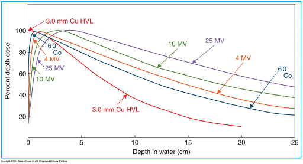

# Dose Distributions (Kahn Ch. 9)

### PDD Tables to know: 

|            |          |               |               |                  |                    |                    |
| ---------- | -------- | ------------- | ------------- | ---------------- | ------------------ | ------------------ |
| **Energy** | **Dmax** | **10 cm PDD** | **10 cm TMR** | **Surface Dose** | **Penumbra Width** | **Rules of Thumb** |
| 6x         | 1.5 cm   | 67%           | 80%           | 30%              | 0.7 cm             | 3%/cm              |
| 10x        | 2.5 cm   | 74%           | 86%           | 16%              | 1.5 cm             | 2.5%/cm            |
| 15x        | 3 cm     | 78%           | 90%           | 8%               | 2.0 cm             | 2%/cm              |
| 18x        | 3.5 cm   | 80%           | 92%           | 6%               | 2.5 cm             | 2%/cm              |
| 6MeV       | 1.5 cm   | 65%           | 80%           | 50%              | 1.0 cm             | 3%/cm              |
| 10MeV      | 2.5 cm   | 72%           | 85%           | 30%              | 1.5 cm             | 2.5%/cm            |
| 15MeV      | 3.5 cm   | 78%           | 90%           | 10%              | 2.0 cm             | 2%/cm              |

____

### Basic concepts for photon fields: 

- **Increasing Energy:**
	- Decreases skin dose
	- Increases dmax depth
	- Increases dose tail

- **Increasing Field Size:**
	- Dose increases in buildup region
	- Dmax is shifted to shallower depths due to secondary electron contributions.
	- Skin sparing is reduced.

- **Increasing SSD:**
	- Increases PDD (less affected by ISL, making for a more uniform distribution). Deep seeded tumors benefit from SSDs > 80 cm.
	- Decreases dose rate (length of treatment).

- **Dmax increases with:**
	- Smaller field size (less surface weighted scatter).
	- Higher Energy

- **PDD increases with**
	- ↑ SSD
	- ↑ Energy
	- ↑ Field Size (Greater lateral scatter pulls the dose more shallow).

____
### Factors affecting dose distribution:

- SSD:
	- Further SSDs reduce absolute dose by inverse square law (1/r^2), and move Dmax to surface due to a reduced difference in 1/r^2.

- Depth
	- PDD in build up, equilibrium, and linear regions.
	- Lower energy components are attenuated more than higher energy, which make the beam harden (increasing size of HVL).

- Field Size
	- Larger fields have a deeper dmax bc of side-scatter contributions.
	- 4A/P calculates equivalent square.

- Beam centrality
	- Different beam spectra near heal of anode.

- Patient tissue electron density:
	- SPR dictates attenuation (Unlike PE which relies on Z3/E3).
	- Compton is independent of Z, but depends on electron density.

- Obliqueness
	- Build-up cloud makes oblique angles have a more surface level PDD.

- Wedge or beam attenuators