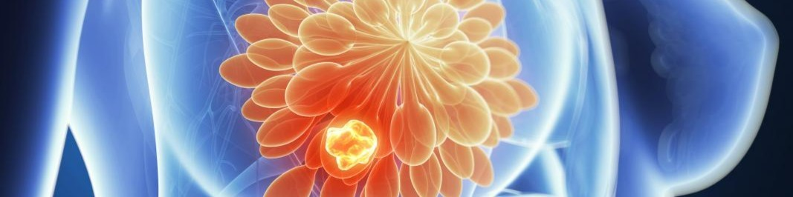

# 🎓 Welcome

## Dr. Byrd's Eye View

### Medical Physics Help Center

A teaching repository for medical physics notes, clinical workflows, QA resources, ABR preparation, and graduate-level educational content.

---

## Browse by Category

- 📘 **[01. Therapy Physics Basics](01.%20Therapy%20Physics%20Basics/)**

    Fundamental radiation physics, dose, interactions, cavity theory, PDDs, electrons, and linac anatomy.

- 🖥️ **[02. IMRT Planning](02.%20IMRT%20Planning/)**

    IMRT, VMAT, optimization, objectives, planning strategy, and plan evaluation.

- ✅ **[03. Quality Assurance](03.%20Quality%20Assurance/)**

    Machine QA, TG reports, commissioning, PSQA, detector systems, and clinical checks.

- ☢️ **[04. Radiation Safety](04.%20Radiation%20Safety/)**

    Shielding, NRC regulations, contamination control, patient release criteria, and surveys.

- 📍 **[05. Brachytherapy](05.%20Brachytherapy/)**

    HDR, LDR, source calibration, applicators, treatment planning, and brachy QA.

- ⚛️ **[06. Proton Therapy](06.%20Proton%20Therapy/)**

    Proton physics, planning, range uncertainty, robustness, imaging, and machine QA.

- ⭐ **[07. Special Topics](07.%20Special%20Topics/)**

    Adaptive radiotherapy, MRI-Linac, TBI, TSET, and emerging technologies.

- 🫁 **[08. Imaging](08.%20Imaging/)**

    CT, MRI, PET, DECT, IGRT, SGRT, ultrasound, and image registration.

- 🎯 **[09. SRS-SBRT](09.%20SRS-SBRT/)**

    Small-field dosimetry, commissioning, Gamma Knife, CyberKnife, and linac-based SRS.

- 🧩 **[10. FMEA & TG-100](10.%20FMEA%20%26%20TG-100/)**

    Risk analysis, process mapping, quality management, and TG-100 implementation.

- 🫀 **[11. Anatomy](11.%20Anatomy/)**

    Clinical anatomy, contours, organs-at-risk, and treatment planning structures.

---

## 🚀 Start Here  
  
1. 📘 [Therapy Physics Basics](01.%20Therapy%20Physics%20Basics/)  
	- Radiation interactions, cavity theory, PDDs, electrons, and linac anatomy.  
  
2. 🖥️ [IMRT Planning](02.%20IMRT%20Planning/)  
	- Optimization, VMAT, objectives, and plan evaluation.  
  
3. ✅ [Quality Assurance](03.%20Quality%20Assurance/)  
	- TG-51, commissioning, machine QA, and PSQA.  
  
4. ☢️ [Radiation Safety](04.%20Radiation%20Safety/)  
	- Shielding, NRC regulations, surveys, and patient release criteria.  
  
5. 🎯 [SRS-SBRT](09.%20SRS-SBRT/)  
	- Small-field dosimetry, commissioning, and stereotactic QA.

---
## Quick Links 

- 🧠 [ESAPI Resources](ESAPI%20Resources/)  
- 📚 [Graduate Classes](Graduate%20Classes/)  
- 📖 [TG Reports](TG-reports/)  
- 🎯 [ABR Exam Prep](ABR%20Part%203%20Review/)  
- 🔬 [Research Portfolio](https://scholar.google.com/citations?user=aRO_5N0AAAAJ&hl=en)

---

> **Tip:** Use the sidebar to browse by topic or the search bar to quickly find a report, equation, workflow, or clinical concept.

## Last Updated

June 2026